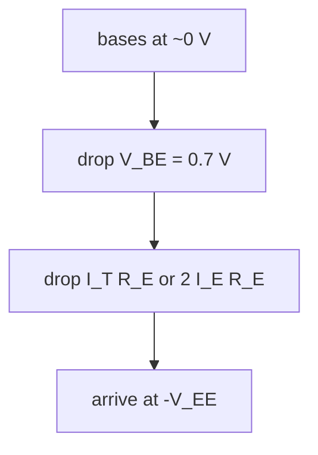
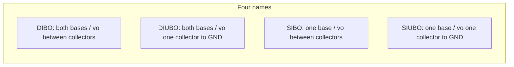
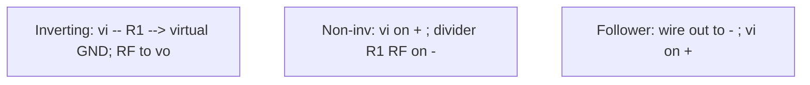

# ECL308 ACD crash course — 20 h from zero

How to use: one mini-lesson at a time. Read **basics + diagram + boxed formula**, then the worked PYQ. Cover the **You try** solution, write yours, then uncover. Last 30 min: rewrite `midsem-formulas.md` from memory.

**In scope:** Units I–III linear only. **Skip:** Schmitt, filters, 555, ADC/DAC, PLL, 723.

Constants unless the paper says otherwise: \(V_{BE}=0.7\,\mathrm{V}\), \(V_T=26\,\mathrm{mV}\), \(\beta\) large \(\Rightarrow I_C\approx I_E\).

---

# Block 0 — circuit habits

You do not need year-1 EDC. You need five moves this paper uses on every page.

## 0.1 KVL on the tail (DC of every diff amp)

Walk a loop: signed voltage drops sum to zero. Base at (about) ground, emitter resistor down to \(-V_{EE}\):

\[
0 - V_{BE} - I_E R_E + V_{EE} = 0 \implies I_E=\frac{V_{EE}-V_{BE}}{R_E}
\]

Two matched emitters sharing one tail: the tail current **splits in half**, so a \(2\) appears.

**Formula to freeze**

\[
I_T=\frac{|V_{EE}|-0.7}{R_E},\qquad I_{E1}=I_{E2}=I_T/2
\]

Two-resistor form (DC equivalent in Unit-II notes): \(I_E=(V_{EE}-V_{BE})/(2R_E)\). Same number.

### Worked: Assignment 1 p.1 (tail)

Matched pair, \(V_{CC}=+20\,\mathrm{V}\), \(V_{EE}=-10\,\mathrm{V}\), \(R_C=3\,\mathrm{k}\Omega\), \(R_B=5\,\mathrm{k}\Omega\) to ground, \(R_E=2\,\mathrm{k}\Omega\) to \(-10\,\mathrm{V}\). \(\beta=100\).

1. \(I_T=(10-0.7)/2\,\mathrm{k}=4.65\,\mathrm{mA}\).
2. Split: \(I_E=2.325\,\mathrm{mA}\approx I_C\).
3. \(V_C=20-(2.325\,\mathrm{mA})(3\,\mathrm{k})=13.025\,\mathrm{V}\).
4. \(I_B=23.25\,\mu\mathrm{A}\), \(V_B=-I_B R_B=-116\,\mathrm{mV}\). True \(V_E\approx-0.82\,\mathrm{V}\), so \(I_T\) is a hair low. Exam first shot uses \(0.7\,\mathrm{V}\).

### You try

A matched pair has \(R_E=10\,\mathrm{k}\Omega\) to \(V_{EE}=-8\,\mathrm{V}\). Find \(I_T\) and each \(I_E\).

Solution

\(I_T=(8-0.7)/10\,\mathrm{k}=0.73\,\mathrm{mA}\). Each \(I_E=365\,\mu\mathrm{A}\).

## 0.2 Divider, \(A\), \(R_i\), \(R_o\)

**Divider** (this is \(V_+\) of every difference amp and the IA second stage):

\[
V_\mathrm{out}=\frac{R_\mathrm{bottom}}{R_\mathrm{top}+R_\mathrm{bottom}}V_\mathrm{in}
\]

- **Gain** \(A=v_o/v_i\) (or \(v_o/v_{id}\)). Can be negative (phase flip).
- **\(R_i=v_x/i_x\)** looking into the input. High \(R_i\) ⇒ previous stage is not loaded.
- **\(R_o\)** looking into the output. Low \(R_o\) ⇒ next stage is not loaded.

A **voltage follower** exists to be \(A=1\), \(R_i\to\infty\), \(R_o\to 0\).

## 0.3 BJT as a current tool + \(r_e\)

- Silicon on: \(V_{BE}\approx 0.7\,\mathrm{V}\).
- \(I_C=\beta I_B\approx I_E\) when \(\beta\) is large. Do **not** grind hybrid-π unless they ask for \(r_\pi\).
- Small-signal resistance of the emitter:

**Formula to freeze**

\[
r_e=\frac{V_T}{I_E},\qquad r_\pi=\beta r_e=\frac{\beta V_T}{I_C}
\]

Every Unit I AC gain is \(R_C/r_e\) or \(R_C/(2r_e)\).

### Worked: 2023 MST Q1

“BJT differential amplifier uses a \(300\,\mu\mathrm{A}\) bias current. \(r_\pi\) of each device? \(\beta=150\).”

Bias current = **tail** \(I_T=300\,\mu\mathrm{A}\) \(\Rightarrow\) each \(I_E=150\,\mu\mathrm{A}\).

\[
r_e=\frac{26\,\mathrm{mV}}{150\,\mu\mathrm{A}}=173\,\Omega,\qquad r_\pi=\beta r_e=150\times173=26\,\mathrm{k}\Omega
\]

Shortcut: \(r_\pi=\beta V_T/(I_T/2)=150\times 0.026/150\times10^{-6}=26\,\mathrm{k}\Omega\) exactly.

### You try

Same pair, they ask for \(r_e\) instead of \(r_\pi\). \(V_T=26\,\mathrm{mV}\).

Solution

\(173\,\Omega\). (\(25\,\mathrm{mV}\) gives \(167\,\Omega\) — write which \(V_T\) you used.)

---

# Block 1 — Unit I differential amplifier

A differential amplifier amplifies the **difference** \(v_{id}=v_{in1}-v_{in2}\) and (ideally) rejects what is common to both. It is the input stage of every 741.

## 1.1 Name the four configs in two seconds

| Name | Bases driven | Where is \(v_o\) | \(A_d\) |
|------|----------------|------------------|---------|
| **DIBO** | both | **between** collectors | \(R_C/r_e\) |
| **DIUBO** | both | **one** collector to GND | \(R_C/(2r_e)\) — half |
| **SIBO** | one (other AC-grounded) | between collectors | \(R_C/r_e\) |
| **SIUBO** | one | one collector to GND | \(R_C/(2r_e)\) |

Balanced = both collectors at the same DC, so \(v_{C2}-v_{C1}\) has **zero DC**. Unbalanced = you look at one collector, so a large DC sits on the signal. That DC is why a **level shifter** follows DIUBO inside the 741.

**Formula to freeze:** dual-input \(\Rightarrow\) same \(A_d\) as the matching single-input. Balanced is **twice** unbalanced.

## 1.2 DC — write once, reuse four times

Short both inputs to AC-ground. KVL down one base–emitter–tail:

\[
I_B R_{in}+V_{BE}+2I_E R_E=V_{EE}
\]

\(I_B=I_E/\beta\). If \(\beta\) is large, drop \(R_{in}/\beta\):

**Formula to freeze**

\[
I_E=I_C=\frac{V_{EE}-V_{BE}}{2R_E},\qquad V_{CE}=V_{CC}-I_C R_C+V_{BE}
\]

Exact: \(I_E=(V_{EE}-V_{BE})/(R_{in}/\beta+2R_E)\). Same \(I_{CQ},V_{CEQ}\) for all four configs.

### Worked: Analog Unit-II tutorial (operating point)

\(R_C=2.2\,\mathrm{k}\), \(R_E=4.7\,\mathrm{k}\), \(R_{in}=50\,\Omega\), \(\pm 10\,\mathrm{V}\), \(\beta=100\), \(V_{BE}=0.715\,\mathrm{V}\).

\[
I_{CQ}=\frac{10-0.715}{50/100+2\times4.7\,\mathrm{k}}=\frac{9.285}{9400.5}=0.988\,\mathrm{mA}
\]

\[
V_{CEQ}=10-(0.988\,\mathrm{mA})(2.2\,\mathrm{k})+0.715=8.54\,\mathrm{V}
\]

## 1.3 AC — why balanced is twice unbalanced

Each transistor looks like a CE stage with gain \(R_C/r_e\), but the two emitters are tied.

- Drive **both** bases with a pure difference (\(v_{in1}=-v_{in2}=v_{id}/2\)). The tail node is a **virtual AC ground** (the two \(i_e\) cancel in \(R_E\)). Each device sees \(v_{id}/2\) across its \(r_e\), so \(i_c=v_{id}/(2r_e)\).
- Take \(v_o=v_{C2}-v_{C1}=2\times(R_C i_c)=(R_C/r_e)\,v_{id}\). **DIBO / SIBO: \(A_d=R_C/r_e\).**
- Take only one collector: you lose one of those two swings. **DIUBO / SIUBO: \(A_d=R_C/(2r_e)\).**

\(R_i\) into one base (other grounded) \(\approx 2\beta r_e\). \(R_o=R_C\). With emitter degeneration \(r_E\): replace \(r_e\) by \(r_e+r_E\).

Single-ended in / single-ended out (Assignment 1): \(A_{v,\mathrm{SE}}=R_C/[2(r_e+r_E)]\). Differential out is **twice** that.

### Worked: Unit-II tutorial 2 (same numbers, \(V_T=25\,\mathrm{mV}\))

\(r_e=25/0.988=25.3\,\Omega\).

\[
A_d=\frac{2.2\,\mathrm{k}}{25.3}=86.96,\qquad R_i=2\beta r_e=5.06\,\mathrm{k}\Omega,\qquad R_o=2.2\,\mathrm{k}
\]

### Worked: 2022 MST Q2 Set A (DIBO \(v_o\))

\(R_E=4.7\,\mathrm{k}\), \(R_C=2.2\,\mathrm{k}\), \(R_{in}=50\,\Omega\), \(\beta=100\), \(V_{BE}=0.7\,\mathrm{V}\). \(v_1=30\,\mathrm{mV_{pp}}\), \(v_2=50\,\mathrm{mV_{pp}}\), same \(2\,\mathrm{kHz}\). Supplies not printed — use the tutorial’s \(\pm 10\,\mathrm{V}\).

\[
I_E=\frac{10-0.7}{50/100+2\times4.7\,\mathrm{k}}=0.989\,\mathrm{mA},\quad r_e=\frac{26\,\mathrm{mV}}{0.989\,\mathrm{mA}}=26.3\,\Omega
\]

\[
A_d=\frac{2.2\,\mathrm{k}}{26.3}=83.7,\qquad v_{id,\mathrm{pp}}=30-50=-20\,\mathrm{mV_{pp}}
\]

\[
v_{o,\mathrm{pp}}=\lvert A_d v_{id}\rvert=1.67\,\mathrm{V_{pp}}
\]

Clipping: each collector can swing about \(I_C R_C\). Balanced differential peak \(\approx 2I_C R_C\), so \(v_{o,\mathrm{pp,max}}\approx 4I_C R_C\approx 8.7\,\mathrm{V}\). If they want the conservative “one collector” number, \(2I_C R_C\approx 4.35\,\mathrm{V}\). Write the assumption.

### Worked: 2022 MST Q3 Set A (SIBO vs SIUBO)

Figure 2: one tail \(R_T=10\,\mathrm{k}\), \(R_C=10\,\mathrm{k}\), \(\pm 10\,\mathrm{V}\).

\[
I_T=\frac{10-0.7}{10\,\mathrm{k}}=0.93\,\mathrm{mA},\quad I_E=0.465\,\mathrm{mA},\quad r_e=56\,\Omega
\]

- Single-ended in, **differential** out (SIBO): \(A_d=R_C/r_e=179\).
- Single-ended in, **single-ended** out (SIUBO): \(A_d=R_C/(2r_e)=89.4\).

### You try — 2022 Set B Q3

Same figure, \(R_T=10\,\mathrm{k}\), \(R_C=10\,\mathrm{k}\), \(\pm 15\,\mathrm{V}\). Find the two gains.

Solution

\(I_T=(15-0.7)/10\,\mathrm{k}=1.43\,\mathrm{mA}\), \(I_E=0.715\,\mathrm{mA}\), \(r_e=36.4\,\Omega\). Diff-out \(A_d=10\,\mathrm{k}/36.4=275\). SE-out \(137\).

## 1.4 Current mirror

A diode (or diode-connected transistor) from the bias node to \(-V_{EE}\) plus a resistor \(R\) from \(+V_{CC}\) sets

\[
I_\mathrm{ref}=I_\mathrm{diode}=\frac{V_{CC}-V_D-V_{EE}}{R}=\frac{V_{CC}+|V_{EE}|-0.7}{R}
\]

An identical transistor with the same \(V_{BE}\) **copies** that current as the tail. DC: \(I_T\approx I_\mathrm{ref}\). AC: the mirror looks like a huge resistor, so \(A_{cm}\) collapses and **CMRR jumps**.

### Worked: 2022 MST Q1 Set A

\(R_B=8\,\mathrm{k}\), \(R=10\,\mathrm{k}\), \(R_C=10\,\mathrm{k}\), \(V_{CC}=15\,\mathrm{V}\), \(V_{EE}=-10\,\mathrm{V}\).

Diode from the CS base to \(-10\,\mathrm{V}\), \(R\) from \(+15\,\mathrm{V}\) to that node:

\[
I_\mathrm{diode}=\frac{15-(-10)-0.7}{10\,\mathrm{k}}=2.43\,\mathrm{mA}\approx I_T
\]

\[
I_E=1.215\,\mathrm{mA},\quad r_e=21.4\,\Omega,\quad A_d=\frac{R_C}{r_e}=\frac{10\,\mathrm{k}}{21.4}=467
\]

(\(R_B\) only sets the pair’s base DC; it does not set \(I_T\).)

### You try — 2022 Set B Q1

Same circuit, \(V_{EE}=-15\,\mathrm{V}\). Find \(I_\mathrm{diode}\) and \(A_d\).

Solution

\(I_\mathrm{diode}=(15-(-15)-0.7)/10\,\mathrm{k}=2.93\,\mathrm{mA}\). \(I_E=1.465\,\mathrm{mA}\), \(r_e=17.7\,\Omega\), \(A_d=10\,\mathrm{k}/17.7=564\).

## 1.5 Level shifter + cascade / Darlington

After a DIUBO stage, \(V_C=V_{CC}-I_C R_C\) is several volts above ground. A level shifter (emitter follower, sometimes a \(V_{BE}\) / zener stack) **subtracts DC** so the signal is centered at \(0\,\mathrm{V}\).

**741 internal chain (must draw):**

**Cascade:** \(A_{v,\mathrm{tot}}=A_{v1}A_{v2}\cdots\) **after** replacing \(R_{C1}\) by \(R_{C1}\parallel R_{i2}\). \(R_i\) is the first stage’s. \(R_o\) is the last stage’s.

**Darlington:** two NPNs, emitter of the first into base of the second. \(\beta_\mathrm{eq}\approx\beta_1\beta_2\), \(V_{BE,\mathrm{eq}}\approx 1.4\,\mathrm{V}\). Treat as one super-transistor, then the same DC + \(r_e\) dance.

### Worked: Assignment 1 (SE vs differential, extra \(r_E\))

\(V_{EE}=8\,\mathrm{V}\), \(R_T=10\,\mathrm{k}\), \(R_C=8\,\mathrm{k}\), extra \(r_E=30\,\Omega\).

\[
I_T=(8-0.7)/10\,\mathrm{k}=730\,\mu\mathrm{A},\quad I_E=365\,\mu\mathrm{A},\quad r_e'=71.2\,\Omega
\]

\[
A_{v,\mathrm{SE}}=\frac{8\,\mathrm{k}}{2(71.2+30)}=39.5,\qquad A_{v,\mathrm{diff}}=79
\]

### You try — 2023 Q3 method (do not skip)

Q1–Q3 and Q2–Q4 are Darlington pairs, \(R_1=R_2=10\,\mathrm{k}\) to \(+15\,\mathrm{V}\), tail \(R_3=12\,\mathrm{k}\) to \(-15\,\mathrm{V}\), then a Darlington follower on one collector (\(R_4=12\,\mathrm{k}\), \(R_5=2\,\mathrm{k}\)). \(\beta=100\).

Recipe on the paper:

1. Tail: two \(V_{BE}\) in the Darlington, \(I_T=(15-1.4)/12\,\mathrm{k}=1.13\,\mathrm{mA}\). Each side \(I_C\approx 0.567\,\mathrm{mA}\).
2. \(V_{C1}=V_{C2}=15-(0.567\,\mathrm{mA})(10\,\mathrm{k})=9.33\,\mathrm{V}\).
3. \(R_i\) looking into a Darlington \(\approx \beta^2(2r_e)\) order — huge. \(A_{v1}=R_C/r_e\) with \(r_e=V_T/(I_T/2)\), then multiply by the follower \(\approx 1\).

Write currents and voltages first. Gain second. That is the 10-mark question.

---

# Block 2 — 741, feedback, numbers

## 2.1 Golden rules + pins + table

If and only if the op-amp is in **negative feedback** and not slammed into the rail:

1. \(I_+=I_-=0\) (no current into the pins).
2. \(V_+=V_-\) (virtual short). If \(V_+\) is ground, \(V_-\) is **virtual ground**.

No negative feedback (comparator): rule 2 is false. Mid-sem linear apps use rule 2.

Ideal op-amp is a **VCVS**: \(R_i=\infty\), \(A=\infty\), \(R_o=0\).

**Pins (8-DIP) — recite:** 1 offset null, 2 inverting, 3 non-inverting, 4 \(-\mathrm{V_{EE}}\), 5 offset null, 6 output, 7 \(+\mathrm{V_{CC}}\), 8 NC.

**741 typical (memorize)**

| Parameter | Ideal | 741 |
|-----------|-------|-----|
| \(A_{OL}\) | \(\infty\) | \(2\times10^5\) |
| \(Z_{in}\) | \(\infty\) | \(2\,\mathrm{M}\Omega\) |
| \(Z_{out}\) | \(0\) | \(75\,\Omega\) |
| \(I_{os}\) | \(0\) | \(20\,\mathrm{nA}\) |
| \(V_{os}\) | \(0\) | \(1\,\mathrm{mV}\) |
| BW / UGB | \(\infty\) | \(1\,\mathrm{MHz}\) |
| CMRR | \(\infty\) | \(90\,\mathrm{dB}\) |
| SR | \(\infty\) | \(0.5\,\mathrm{V/\mu s}\) |

**Two frequency-dependent parameters besides the \(A(f)\) curve (2023 Q2): CMRR and PSRR.**

### Worked: 2022 Q7 / 2023 Q5 (virtual short, 1 mark)

\(v_o=-2\,\mathrm{V}\), \(V_-=-3\,\mathrm{V}\), ideal \(\Rightarrow V_+=-3\,\mathrm{V}\).

They are checking you do **not** write “virtual ground = 0.” Virtual short is \(V_+=V_-\), whatever that common value is.

### You try — 2022 Set B Q7

\(v_o=-4\,\mathrm{V}\), \(V_-=-6\,\mathrm{V}\). \(V_+?\)

Solution

\(-6\,\mathrm{V}\).

## 2.2 Closed-loop algebra (voltage series)

Non-inverting: feedback fraction \(\beta=R_1/(R_1+R_F)\).

**Formula to freeze**

\[
A_f=\frac{A}{1+A\beta}\ \xrightarrow{A\to\infty}\ 1+\frac{R_F}{R_1}
\]

\[
R_{if}=R_i(1+A\beta),\quad R_{of}=R_o/(1+A\beta),\quad f_{cl}=f_{ol}(1+A\beta)
\]

Inverting ideal: \(A_f=-R_F/R_1\). Finite \(A\):

\[
A_f=-\frac{R_F/R_1}{1+(1+R_F/R_1)/A}=-\frac{A R_F}{R_1(1+A)+R_F}
\]

Follower: \(R_F=0\), \(R_1=\infty\) \(\Rightarrow \beta=1\), \(A_f=1\), max BW, huge \(R_i\), tiny \(R_o\).

### Worked: 2022 Q8 Set A

Open-loop \(A=100\), want closed-loop \(-25\), larger resistor \(100\,\mathrm{k}\Omega\). Smaller resistor?

Ideal shot: \(R_F/R_1=25\Rightarrow R_1=4\,\mathrm{k}\Omega\).

Finite-\(A\) shot: let \(G=R_F/R_1\).

\[
25=\frac{G}{1+(1+G)/100}\implies 25=\frac{100G}{101+G}\implies G=33.67
\]

\[
R_1=100\,\mathrm{k}/33.67=2.97\,\mathrm{k}\Omega
\]

Write the finite-\(A\) formula. Box \(2.97\,\mathrm{k}\Omega\) if they gave \(A\); \(4\,\mathrm{k}\) if they wanted the ideal limit.

### You try — 2022 Set B Q8

\(A=200\), \(A_f=-20\), larger resistor \(100\,\mathrm{k}\). Smaller?

Solution

Ideal \(R_1=5\,\mathrm{k}\Omega\). Finite: \(20=200G/(201+G)\Rightarrow G=22.33\), \(R_1=4.48\,\mathrm{k}\Omega\).

## 2.3 Compensated GBW (the recycled GATE question)

A dominant-pole (“compensated”) op-amp:

\[
|A(f)|\approx\frac{A_0 f_c}{f}=\frac{\mathrm{UGB}}{f}\qquad(f\gg f_c)
\]

Then \(A_f=A/(1+A\beta)\). Non-inverting \(G=1+R_F/R_1\) \(\Rightarrow\) \(f_{3\mathrm{dB}}=\mathrm{UGB}/G\).

### Worked: 2022 Q6 = GATE Q17

\(A_0=10^5\), \(f_c=8\,\mathrm{Hz}\), non-inverting \(R_1=1\,\mathrm{k}\), \(R_2=79\,\mathrm{k}\) \(\Rightarrow G=80\), \(\beta=1/80\). Find \(A_f\) at \(15\,\mathrm{kHz}\).

\[
\mathrm{UGB}=10^5\times 8=800\,\mathrm{kHz},\qquad |A(15\,\mathrm{k})|=800/15=53.333
\]

\[
A_f=\frac{53.333}{1+53.333/80}=32
\]

### You try — 2022 Set B Q6

Same circuit at \(30\,\mathrm{kHz}\).

Solution

\(|A|=800/30=26.67\), \(A_f=26.67/(1+26.67/80)=20\).

Also freeze: UGB \(1\,\mathrm{MHz}\), closed-loop \(20\,\mathrm{dB}=10\) \(\Rightarrow f_{3\mathrm{dB}}=100\,\mathrm{kHz}\). Highest gain for a required BW: \(G_\mathrm{max}=\mathrm{UGB}/f_\mathrm{want}\).

## 2.4 CMRR

**Formula to freeze**

\[
\mathrm{CMRR}=\frac{A_d}{A_{cm}},\qquad \mathrm{CMRR_{dB}}=A_{d,\mathrm{dB}}-A_{cm,\mathrm{dB}}
\]

\[
v_o=A_d v_d+A_{cm}v_c,\quad v_d=v_1-v_2,\quad v_c=(v_1+v_2)/2
\]

GATE Q43: \(48\,\mathrm{dB}-2\,\mathrm{dB}=46\,\mathrm{dB}\). Equal resistor ratios on a difference amp \(\Rightarrow\) CMRR \(\to\infty\). Raising tail \(R_E\) (or using a mirror) raises CMRR; \(A_d\) barely changes.

## 2.5 Offset, bias, compensating \(R_C\)

\(I_B=(I_{B1}+I_{B2})/2\), \(I_{os}=|I_{B1}-I_{B2}|\). Model \(V_{os}\) as a battery in series with one input. Signal grounded, non-inverting gain \(G\): \(V_o=G\,V_{os}\).

Compensating resistor on the unused input: \(R_C=R_1\parallel R_F\) (kills the average \(I_B\); \(I_{os}\) remains).

Open-loop + offset rails: \(A=10^4\), \(V_{os}=5\,\mathrm{mV}\) \(\Rightarrow 50\,\mathrm{V}\) which **hits** \(\pm 15\,\mathrm{V}\).

### Worked: 2023 Q6

Non-inverting gain \(200\), \(V_{os}=\pm 2\,\mathrm{mV}\), input \(0.01\sin\omega t\).

\[
v_o=200\bigl(0.01\sin\omega t\pm 0.002\bigr)=2\sin\omega t\pm 0.4\,\mathrm{V}
\]

If they take the input as 0, \(V_o=\pm 400\,\mathrm{mV}\). Read the question: 2023 has the sine.

## 2.6 Slew rate

**Formula to freeze**

\[
\mathrm{SR}=\left.\frac{dv_o}{dt}\right|_{\max},\qquad t=\frac{\Delta V}{\mathrm{SR}},\qquad \mathrm{SR}\ge 2\pi f V_p
\]

741 typical \(0.5\,\mathrm{V/\mu s}\).

### Worked: 2023 Q7

\(-10\to+10\,\mathrm{V}\), \(\mathrm{SR}=0.5\,\mathrm{V/\mu s}\) \(\Rightarrow t=20/0.5=40\,\mu\mathrm{s}\).

### You try — GATE Q9 style

\(\mathrm{SR}=1\,\mathrm{V/\mu s}\), gain \(40\,\mathrm{dB}=100\), \(f=20\,\mathrm{kHz}\). Max undistorted **input** peak?

Solution

Max \(V_{o,p}=\mathrm{SR}/(2\pi f)=10^6/(2\pi\cdot 20\,\mathrm{k})=7.96\,\mathrm{V}\). Max input \(=7.96/100=79.6\,\mathrm{mV}\).

---

# Block 3 — Unit III linear applications

Derive each once from KCL + virtual short. Then freeze the boxed formula.

## 3.1 Inverting / non-inverting / follower

- Inverting: \(V_-=0\), \(i=v_i/R_1=(0-v_o)/R_F\Rightarrow v_o/v_i=-R_F/R_1\). Looking in from \(v_i\): \(R_i=R_1\) (GATE Q48).
- Non-inverting: \(V_-=v_i\), \(v_i=v_o R_1/(R_1+R_F)\Rightarrow 1+R_F/R_1\). \(R_i\to\infty\).
- Follower: \(v_o=v_i\). Use it so a \(100\,\mathrm{k}\) source can drive a \(1\,\mathrm{k}\) load.

### Worked: 2022 Q5 (follower + pot)

\(20\,\mathrm{k}\) + \(100\,\mathrm{k}\) pot + \(20\,\mathrm{k}\) between \(+15\,\mathrm{V}\) and \(-15\,\mathrm{V}\). Follower on the wiper.

Total \(140\,\mathrm{k}\). \(I=30/140\,\mathrm{k}=0.214\,\mathrm{mA}\). Drop on each \(20\,\mathrm{k}\) is \(4.29\,\mathrm{V}\). Wiper range \(\approx\pm 10.7\,\mathrm{V}\). Follower \(\Rightarrow v_o\) is that same range (or \(0\) if they parked the wiper in the middle — state the assumption).

## 3.2 Summing design (2023 Q8)

Inverting summer: \(v_o=-R_F\sum v_k/R_k\).

**Design** \(v_o=V_1+3V_2-2V_3-6V_4\) with **one** op-amp. (\(V_o=V_1+3V_2-2(V_3+3V_4)\).)

- Put \(V_3,V_4\) on the inverting side. Choose \(R_F=R\). Then \(R_3=R/2\) (weight 2), \(R_4=R/6\) (weight 6).
- \(R_{\parallel,-}=(R/2)\parallel(R/6)=R/8\).
- Non-inverting multiplier: \(1+R_F/R_{\parallel,-}=9\).
- Need \(9\cdot V_+=V_1+3V_2\Rightarrow V_+=(1/9)V_1+(1/3)V_2\).

A 3-resistor network on (+): conductances in the ratio \(1:3:5\) because \(1/9+3/9+5/9=1\). Example: \(R_a=9R_0\) to \(V_1\), \(R_b=3R_0\) to \(V_2\), \(R_g=(9/5)R_0\) to ground. Draw it; label the ratios.

### You try

Design \(v_o=2V_1-V_2\) with one inverting summer plus a sign flip, **or** one op-amp with \(V_1\) on (+) and \(V_2\) on (−). Sketch and pick resistors.

Solution

One-op-amp: \(R_F=R\), \(R_2=R\) on (−) for weight 1. \(R_{\parallel,-}=R\), multiplier \(=2\). Need \(2V_+=2V_1\Rightarrow V_+=V_1\), so \(V_1\) directly on (+). That is a difference amp with \(R_F/R_1=1\) and \(V_+\) not divided. Or invert \(V_2\) with \(R_F/R=1\) and sum with a second stage — two op-amps, also accepted if labelled.

## 3.3 Difference amplifier

\(V_+\) is a divider on \(v_2\). Virtual short, KCL at \(V_-\):

\[
v_o=\left(1+\frac{R_F}{R_1}\right)\frac{R_3}{R_2+R_3}v_2-\frac{R_F}{R_1}v_1
\]

**Balance** \(R_F/R_1=R_3/R_2=\alpha\) collapses to \(v_o=\alpha(v_2-v_1)\).

If the ratios do **not** match, collect \(v_1\) and \(v_2\) separately (GATE Q6, Q44, Q52, Q69).

### Worked: GATE Q52

Same \(1\,\mathrm{V}\) to both sides, \(1\,\mathrm{k}+1\,\mathrm{k}\) divider on (+), \(R_F=2\,\mathrm{k}\), inv \(R=1\,\mathrm{k}\).

\(V_+=0.5\,\mathrm{V}\), \(v_o=0.5(1+2)-2\cdot 1=-0.5\,\mathrm{V}\).

## 3.4 Instrumentation amplifier (2023 Q9)

Three op-amps. Front pair: \(V_{o2}-V_{o1}=(1+2R_f/R_G)(V_2-V_1)\). Back difference stage: \(\times R_2/R_1\).

**Formula to freeze**

\[
v_o=\frac{R_2}{R_1}\left(1+\frac{2R_f}{R_G}\right)(v_2-v_1)
\]

One resistor \(R_G\) sets the gain. Common-mode (the \(60\,\mathrm{Hz}\) on both lines) cancels; the small opposite \(1\,\mathrm{kHz}\) pieces add.

2023 Q9: \(V_1=3\sin(2\pi 60t)+0.01\sin(2\pi 1000t)\), \(V_2=3\sin(2\pi 60t)-0.01\sin(2\pi 1000t)\). Draw the 3-op-amp IA. Gain of 10 on the \(1\,\mathrm{kHz}\) difference. \(R_1=R_1'=10\,\mathrm{k}\).

\(v_d=V_2-V_1=-0.02\sin(2\pi 1000t)\). Want \(|A_d|=10\). Clean: \(R_2=R_1=10\,\mathrm{k}\) and \(1+2R_f/R_G=10\Rightarrow R_G=2R_f/9\) (e.g. \(R_f=9\,\mathrm{k}\), \(R_G=2\,\mathrm{k}\)).

## 3.5 T-network

Need large \(|A_f|\) without a \(10\,\mathrm{M}\) resistor. Replace \(R_F\) by a T: \(R_a\) from (−) to mid, \(R_b\) mid to out, \(R_c\) mid to GND.

**Formula to freeze**

\[
R_{F,\mathrm{eq}}=R_a+R_b+\frac{R_a R_b}{R_c},\qquad A_f=-R_{F,\mathrm{eq}}/R_1
\]

### Worked: Kanodia Q5

\(R_1=100\,\mathrm{k}\), \(A_f=-10\), T is \(R\), \(100\,\mathrm{k}\), \(100\,\mathrm{k}\).

\[
R+100\,\mathrm{k}+\frac{R\cdot 100\,\mathrm{k}}{100\,\mathrm{k}}=1\,\mathrm{M}\implies 2R+100\,\mathrm{k}=1\,\mathrm{M}\implies R=450\,\mathrm{k}\Omega
\]

### Worked: 2023 Q4 (T in the paper)

\(R_1=1\,\mathrm{k}\), T: \(10\,\mathrm{k}\) + \(10\,\mathrm{k}\) with \(1\,\mathrm{k}\) to ground.

\[
R_{F,\mathrm{eq}}=10+10+(10\times 10)/1=120\,\mathrm{k},\qquad A_f=-120
\]

### You try — GATE Q77 idea

\(|A_f|=12\), \(R_1=10\,\mathrm{k}\), two \(10\,\mathrm{k}\) in the series arms of the T. Find the shunt \(R_c\).

Solution

\(R_{F,\mathrm{eq}}=12\times 10\,\mathrm{k}=120\,\mathrm{k}=10+10+100/R_c\) (kΩ). \(100=100/R_c\Rightarrow R_c=1\,\mathrm{k}\Omega\). (If the 10k are \(R_a,R_b\) in kΩ: \(R_a R_b/R_c=100\).)

## 3.6 Integrator / differentiator waveforms

Ideal integrator: \(C\) in feedback, \(R\) in. \(v_o=-(1/RC)\int v_i\,dt\).

Ideal differentiator: \(C\) in, \(R\) in feedback. \(v_o=-RC\,dv_i/dt\).

| Drive | Integrator | Differentiator |
|-------|------------|----------------|
| DC | ramp \(\to\pm V_{sat}\) | 0 |
| square | triangle | spikes |
| triangle | parabola | **square** |
| sine \(\sin\omega t\) | \(-\)cosine / \(1/\omega\) | \(-\omega RC\cos\omega t\) |

Practical integrator: \(R_F\) across \(C\). Practical differentiator: small \(R\) in series with \(C\). Integrator Bode falls \(20\,\mathrm{dB/dec}\); differentiator rises \(20\,\mathrm{dB/dec}\) until UGB.

### Worked: 2022 Q4 Set A

Differentiator \(R=10\,\mathrm{k}\), \(C=0.001\,\mu\mathrm{F}\). Triangle \(0\to 5\,\mathrm{V}\) in \(5\,\mu\mathrm{s}\), back in \(5\,\mu\mathrm{s}\).

\[
RC=10\,\mathrm{k}\times 0.001\,\mu\mathrm{F}=10\,\mu\mathrm{s},\qquad \frac{dv}{dt}=\pm\frac{5}{5\,\mu\mathrm{s}}=\pm 10^6\,\mathrm{V/s}
\]

\[
v_o=-RC\frac{dv}{dt}=\mp 10\,\mathrm{V}
\]

Output is a **square** \(\pm 10\,\mathrm{V}\) (rising slope \(\Rightarrow -10\,\mathrm{V}\)). GATE Q37: triangle into a differentiator \(\Rightarrow\) square.

## 3.7 V–I, I–V, VCCS, CCCS

- **I–V (transimpedance):** current into virtual ground, \(v_o=-I_{in}R_F\).
- **V–I / VCCS (Howland):** matched ratios \(\Rightarrow i_L=v_s/R\) independent of \(R_L\).
- **CCCS:** current in, current out. Discrete version = current mirror. GATE Q78: \(I_o=\frac{\beta}{\beta+1}V_\mathrm{ref}/R\).

Ideal op-amp = **VCVS**. That 1-marker is free.

---

# Block 4 — exam rehearsal

## 4.1 How to sit the paper

- 2022: **1 hour, 25 marks.** Unit I is ~10 marks. Do Q1–3 first, then Q6 (GBW, 4 marks, 4 minutes), then 1-mark virtual short, then design/algebra.
- 2023: **1.5 hours, 25 marks.** Same Unit I start. Q3 Darlington is 10 marks. Then slew / offset / summing / IA / T-network.

Attempt order = high-mark things you can finish. Leave sketches if the clock dies; a labelled \(\pm V_{sat}\) square still scores.

Sit **2022 Set A** with a 60-minute timer, figures from `resources/pyqs/MST_2022.pdf`. Then mark below. Then 2023 MST. Last 30 minutes: close every PDF and recreate `midsem-formulas.md` on one sheet.

## 4.2 2022 MST Set A — solutions (cover while you sit)

| Q | Marks | Method | Answer |
|---|-------|--------|--------|
| 1 | 4 | Mirror: \(I_\mathrm{diode}=(15+10-0.7)/10\,\mathrm{k}\); \(A_d=R_C/r_e\) with \(I_E=I_T/2\) | \(I_D=2.43\,\mathrm{mA}\), \(A_d\approx 467\) |
| 2 | 2 | DIBO \(A_d=R_C/r_e\); \(v_o=A_d(v_1-v_2)\); clip \(\sim 4I_C R_C\) | \(v_{o,\mathrm{pp}}\approx 1.67\,\mathrm{V}\); max ~\(8.7\,\mathrm{V}\) |
| 3 | 4 | Tail \(I_T\); SIBO \(R_C/r_e\); SIUBO \(R_C/(2r_e)\) | \(\approx 179\) and \(89\) |
| 4 | 3 | Differentiator, triangle \(\to\) square \(\pm RC\,\|dv/dt\|\) | square \(\pm 10\,\mathrm{V}\) |
| 5 | 2 | Follower; pot range between the two \(20\,\mathrm{k}\) drops | \(v_o\in[-10.7,+10.7]\,\mathrm{V}\) |
| 6 | 4 | \(\mathrm{UGB}=800\,\mathrm{kHz}\); \(A_f=A/(1+A/80)\) at 15 kHz | **32** |
| 7 | 1 | Virtual short | \(V_+=-3\,\mathrm{V}\) |
| 8 | 3 | Finite \(A\) invert; or ideal \(4\,\mathrm{k}\) | \(2.97\,\mathrm{k}\) (exact) / \(4\,\mathrm{k}\) ideal |
| 9 | 2 | Two rows, subtract to kill \(V_\mathrm{ref}\) | \(\Delta v_o/\Delta v_{in}=5/0.9\); write \(v_o\) from **the figure** then subtract |

Set B twins: \(V_{EE}=-15\), \(\beta=50\), \(v_1=20\,\mathrm{mV_{pp}}\), \(\pm 15\) on Q3, **\(A_f=20\)** at 30 kHz, \(V_+=-6\,\mathrm{V}\), \(A=200\), \(A_f=-20\).

**Q9 algebra:** \(v_o=-(R_F/R_{IN})v_{IN}+(1+R_F/R_{IN})V_+\). If the printed numbers make \(v_o\) *rise* with \(v_{IN}\), \(v_{IN}\) is on the (+) side in that figure — still subtract the two rows. The method is the mark.

## 4.3 2023 MST — solutions

| Q | What | Number |
|---|------|--------|
| 1 | \(r_\pi\) of each device, \(I_T=300\,\mu\mathrm{A}\), \(\beta=150\) | **\(26\,\mathrm{k}\Omega\)** |
| 2 | Two freq-dependent params ≠ freq-response curve | **CMRR, PSRR** |
| 3 | Darlington cascade DC + \(R_i\) + \(A_v\) | Block 1.5 recipe |
| 4 | T-network gain | **\(-120\)** |
| 5 | Virtual short | \(V_+=-3\,\mathrm{V}\) |
| 6 | \(G=200\), \(V_{os}=\pm 2\,\mathrm{mV}\), \(0.01\sin\omega t\) | \(2\sin\omega t\pm 0.4\,\mathrm{V}\) |
| 7 | Slew \(-10\to+10\), \(0.5\,\mathrm{V/\mu s}\) | **\(40\,\mu\mathrm{s}\)** |
| 8 | Design one op-amp for \(V_o=V_1+3V_2-2(V_3+3V_4)\) | Block 3.2 sketch |
| 9 | IA, kill 60 Hz, gain 10 on 1 kHz, \(R_1=10\,\mathrm{k}\) | Block 3.4 |

## 4.4 GATE scan — do these, skip the rest

From `resources/practice/GATE_opamp_01Sep2026.pdf`. Skip filters / Schmitt / regulators.

| Q | Topic | Answer |
|---|--------|--------|
| 2 | Finite \(A\) inverting | (c) 4 |
| 7 | Open-loop + \(V_{os}\) | (c) rails \(\pm 15\,\mathrm{V}\) |
| 8 | Ideal params | (a) \(R_i=\infty,A=\infty,R_o=0\) |
| 9 | Slew + 20 kHz | (c) 79.5 mV |
| 10 | Ideal op-amp is | (b) VCVS |
| 17 | **= 2022 Q6** | **32** |
| 37 | Triangle → differentiator | (a) square |
| 39 | Finite \(A=100\), \(R_F/R_1=10\) | \(A_f\approx -9\) |
| 41 | UGB 1 MHz, 20 dB | (b) 100 kHz |
| 43 | CMRR dB | (c) 46 dB |
| 48 | \(R_i\) of inverter | (b) 10 kΩ |
| 52 | Mixed summer | (c) −0.5 V |
| 75 | Non-inv \(G=3\), \(1\,\mathrm{V}\) | \(3\,\mathrm{V}\) |
| Kanodia 1 | Inv \(400/40\) | (A) −10 |
| Kanodia 5 | T-network | (B) 450 kΩ |

## 4.5 Last 30 minutes

Close every PDF. Recreate `midsem-formulas.md` on one side of one sheet:

1. Four config names + two \(A_d\) formulas.
2. \(I_E=(V_{EE}-V_{BE})/(2R_E)\), \(r_e=V_T/I_E\), \(r_\pi=\beta r_e\).
3. 741 pins + typical table.
4. \(A_f=A/(1+A\beta)\), UGB, slew \(t=\Delta V/\mathrm{SR}\), \(R_C=R_1\parallel R_F\).
5. Invert / non-inv / summer / difference / IA / T-network.
6. Waveform table.

If a box is missing, that box is the first revision target, not a new chapter.
